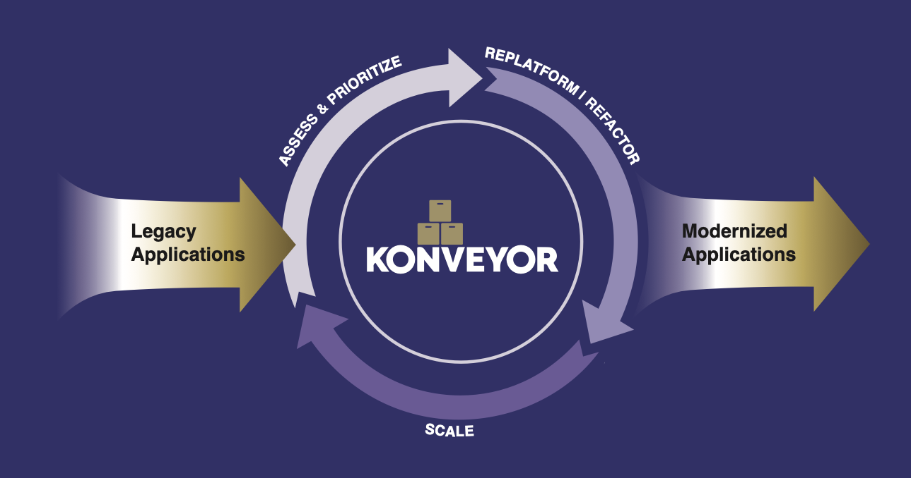

## Konveyor

Konveyor aims to surface insights on applications at scale to empower enterprise architects to make better-informed decisions related to modernization activities

## Overview
Konveyor is an open-source application modernization platform that helps organizations safely and predictably modernize applications to new technologies, with an initial focus on accelerating the adoption of legacy applications to Kubernetes.

The project’s design incorporates years of experience with consulting engagements successfully helping companies move existing applications to new technologies, such as Kubernetes. The patterns and processes that led to successful, predictable, and safe modernization engagements were distilled into [our methodology](https://github.com/konveyor/methodology). This methodology is not required to be used with Konveyor but remains available to help guide others embarking on their own modernization journey who don’t have a preferred methodology.

Konveyor aims to make the modernization of legacy applications to Kubernetes its #1 priority while realizing that technology is evolving and the need for modernizing to new technologies will remain in the future.  We believe the basic patterns to address modernization needs can be built generically into a platform with technology-specific information added as new technologies emerge, thereby allowing the platform to evolve over time to address new needs.

## Vision Statement

To become the ultimate open-source application modernization platform, helping organizations safely and predictably modernize their portfolios to evolving technology needs.

## Mission Statement

Accelerate the adoption of Kubernetes by helping organizations modernize their legacy applications to Kubernetes and cloud-native technologies in a safe and predictable manner at scale, providing value at each phase of the adoption journey.

## Community

Join our Community to stay up to date on developments.
* Join https://groups.google.com/g/konveyorio for information on new Releases and MeetUps.
* Join https://groups.google.com/g/konveyor-community for deeper insights into the development work, with recordings and invites to our public Thursday community [meetings](https://github.com/konveyor/community#meetings).
  * See our prior [community meetings on YouTube](https://www.youtube.com/watch?v=sB0llm1ef8E&list=PL4aUFFbk56EOWBwS9qvEKDn8CAMXDfdw0) for demonstrations of new features
* Share your experiences with modernization problems and participate in our [migration experience user group](https://github.com/konveyor/community/tree/main/ug-migration-experience) focused on bringing learnings back into Konveyor to help ease future migration work. 
* Join as a contributor to coding, documentation, or other interests via our [Special Interest Groups](https://github.com/konveyor/community#konveyor-sig-meetings).
* Ask us a question in kubernetes.slack.com:  (Get a slack invite via: https://slack.k8s.io/)
  * #[konveyor](https://kubernetes.slack.com/archives/CR85S82A2): General questions and discussions
  * #[konveyor-dev](https://kubernetes.slack.com/archives/C04QZJFQ0UA): Developer questions on contributing to Konveyor

## Next steps to read more about Konveyor

* See an example of Konveyor in Action: [konveyor/example-applications/example-1](https://github.com/konveyor/example-applications/tree/main/example-1)
* Get Started by [deploying the Konveyor Operator](https://github.com/konveyor/tackle2-operator#tackle-operator-installation-on-k8s)
* Read about Konveyor's [Unified Experience](https://github.com/konveyor/enhancements/tree/master/enhancements/unified_experience)
* Read the project's [Charter.md](https://github.com/konveyor/community/blob/main/Charter.md)
* Read Konveyor's technical design documentation in [konveyor/enhancements/enhancements](https://github.com/konveyor/enhancements/tree/master/enhancements)
* See existing Konveyor RFEs [konveyor/enhancements/issues](https://github.com/konveyor/enhancements/issues)

## YouTube
* [Konveyor's YouTube channel](https://www.youtube.com/@konveyor361/videos)

## CNCF Sandbox Project

* https://www.cncf.io/projects/konveyor/
  * Konveyor was accepted to CNCF on July 26, 2022 and is at the Sandbox project maturity level.

[Source](https://github.com/konveyor/konveyor.github.io/blob/main/content/_index.md)