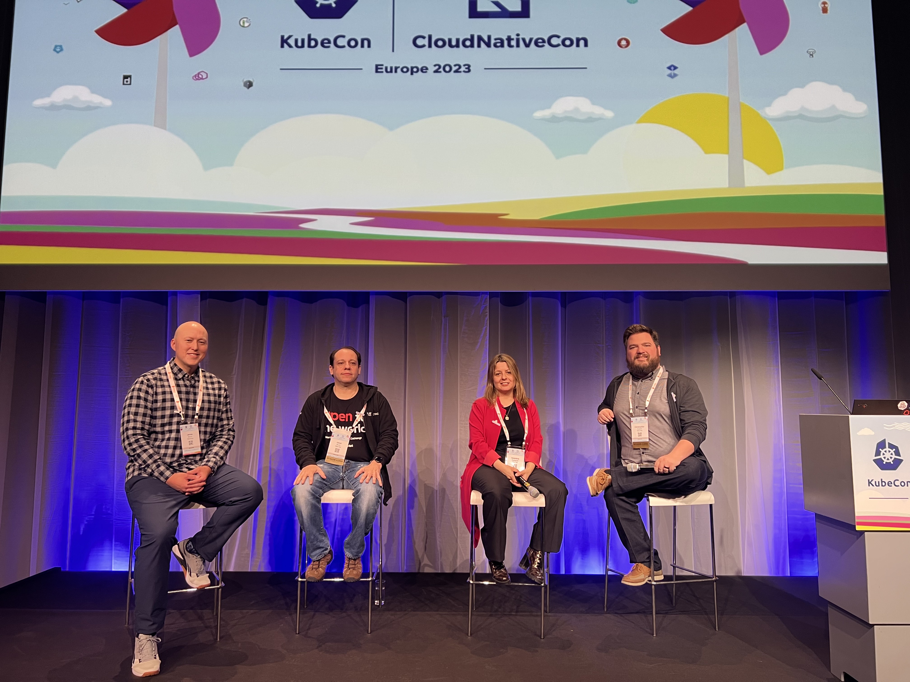

Migrating large infrastructures from an on-premise, monolithic, traditional IT management approach
to a modern cloud-native Kubernetes-based ecosystem is a daunting task. 
Christopher Nuland (Konveyor Ambassador) led a conversation with Jared Burk and Valentina Rodriguez Sosa,  Red Hat; James Bench, Maximus 
about the different migrations they have completed and the challenges they experienced. 

Chris and Valentina summarized the key 6 takeaways that combined questions from the audience
and a summary of the panel discussion held at the KubeCon 23 in AMSTERDAM.

## Knowing where to start:
Starting with the proper process, the right people, and vision is critical for any organization that wants to implement change,
whether it is adopting new technology or any methodology. When thinking about modernization, 
it is important to start understanding the value that it can provide me, such as hardening security,
reducing operational time and costs, and accelerating software development. 
Connecting these values with my organization's mission, vision, and values 
will create the Why for this project and a compelling vision that the teams should be aware of. 
Understanding the why will help create motivation and commitment and reduce any friction between business priorities and modernization's value.

## Create a plan:
Align your goals to create metrics to measure success. If cost reduction is one of the key goals of your modernization plan, 
calculate operational and infrastructure costs before and after any migration.

## Create a pilot project:
Creating a pilot project before the large-scale migration will help reduce any concerns you and your organization
 might have about costs, risks, timeframes, and outcomes. If your concern is about costs, choose one of the most significant 
 and most complex applications as a pilot to understand the level of complexity and amount of work that will end up as a cost for the migration project.  
 You can add a set of pilot apps with each app having different characteristics, so you can look at different measures such as costs, and risks.  
 After the pilot has been succeeded, take lessons learned and compare the metrics you created to ensure you obtain the value you were looking for. 

## Industry Compliance
When planning a cloud-native migration, it's essential to have a thorough understanding of your organization's industry-specific compliance standards, 
such as HIPAA, NIST, and GDPR. This knowledge is particularly crucial when transitioning from an entirely on-premise system.
In these traditional environments, data protection and other compliance standards are often addressed through physical infrastructure and isolation strategies.
This approach can lead to a phenomenon known as 'data gravity', where some data must remain on-premise due to compliance constraints.
Consequently, a hybrid cloud architecture becomes necessary, allowing critical integrations to stay on-premise.
Grasping these intricacies and forming a strategic plan around them are key steps towards a smooth migration that maintains industry compliance. 
This preparation paves the way for a flexible, scalable, and efficient cloud-native system that adheres to industry rules and regulations. 
A balanced approach like this is essential for successful cloud adoption and robust compliance management. 
To prevent compliance issues from stalling your migration process, it's advisable to start understanding 
and addressing your compliance requirements early in the migration process. 
This proactive approach will help ensure a seamless transition to the cloud.

## Getting Organizational Buy-In
Securing organizational buy-in during a large-scale enterprise migration to a cloud-native k8s platform is crucial for the project's success. 
A typical obstacle to smooth transitions is the presence of siloed organizational structures, where information and processes are isolated, 
causing difficulties in coordinating and unifying migration efforts. 
These siloed operations can slow down the migration process, inhibit the efficient use of cloud functionalities, 
and even lead to costly delays. To overcome these challenges, buy-in should start at the highest levels of the organization, 
with the CTO and CEO setting the strategic direction and demonstrating commitment. 
The C-suite's endorsement enables a culture shift, fostering a more collaborative environment conducive to such a significant cloud-native transformation. 
Furthermore, their role extends to ensuring the allocation of appropriate resources and investment in upskilling to enable the organization 
for the change needed for cloud-native transformation. 
This top-down approach needs to cascade to individual contributors, including engineers, who will be integral in the technical aspects of the migration. 
These individuals should understand and endorse the strategic benefits of the migration, and feel empowered to collaborate across different units. 
In this way, the entire organization can work cohesively towards a successful migration, while reaping the many benefits that a cloud-native platform 
can offer such as scalability, reliability, and cost efficiency.

## Don’t reinvent the wheel
When talking about migrations, patterns are critical from the applications to the methodologies and tooling. 
We have seen cases where companies are trying to reinvent the wheel, leading to a significant spend of $$$, resources, 
and sometimes to the right solution for them. We recommend researching and getting involved with community and modernization experts,
 who can help you find the best path quickly and save costs for your organization. 

https://youtu.be/k-Pvzg9eosQ

Help improve the Konveyor project by sharing your application modernization problems and solutions [here](https://github.com/konveyor/community/tree/main/ug-migration-experience). 

Your learnings will be used to improve the Konveyor project and help ease others modernize.
