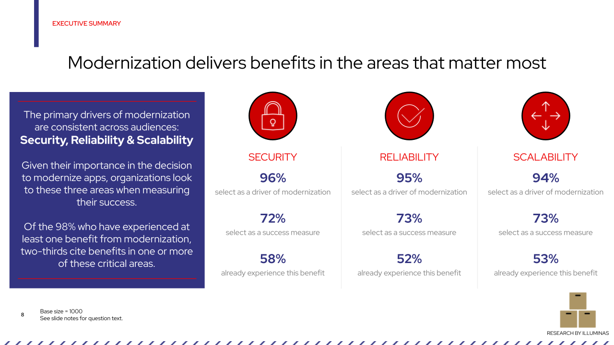
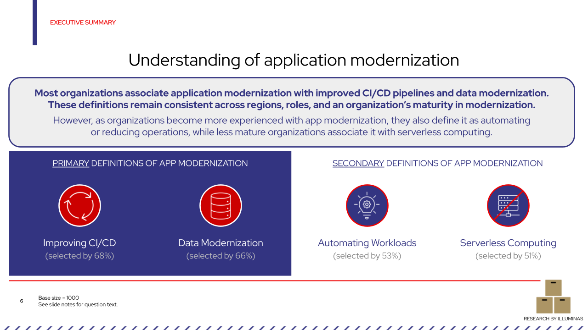
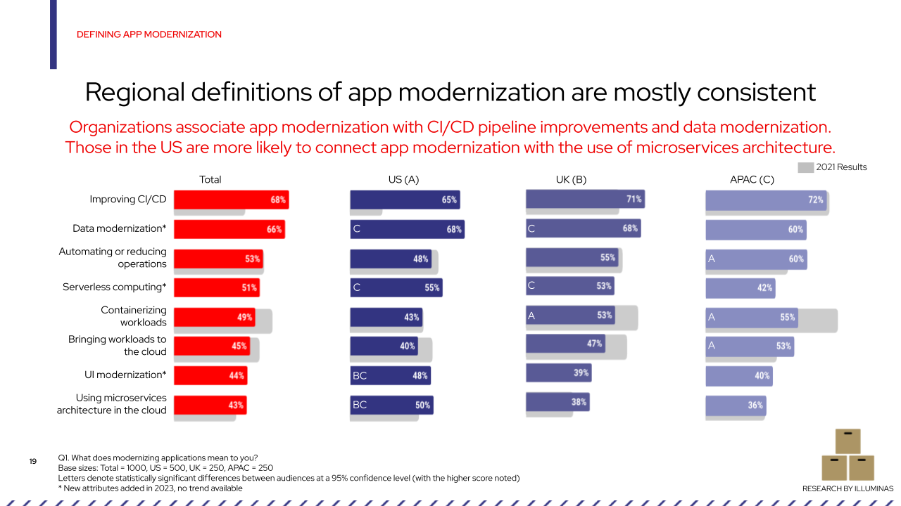
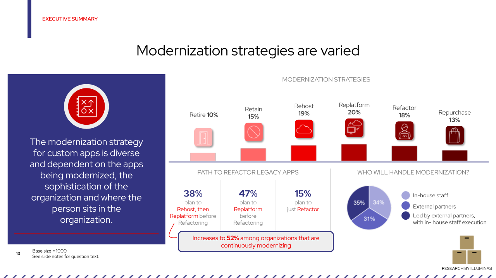
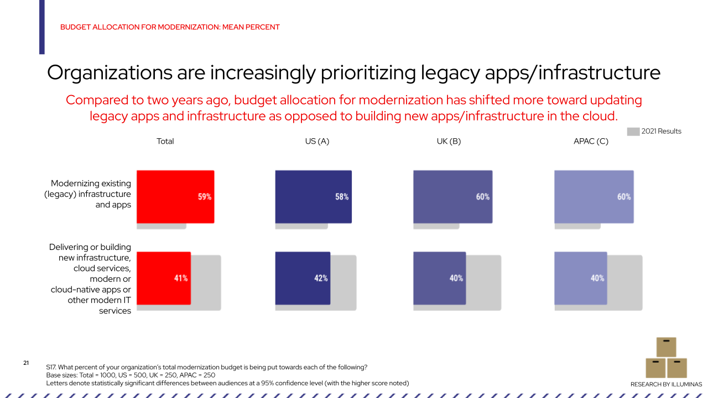
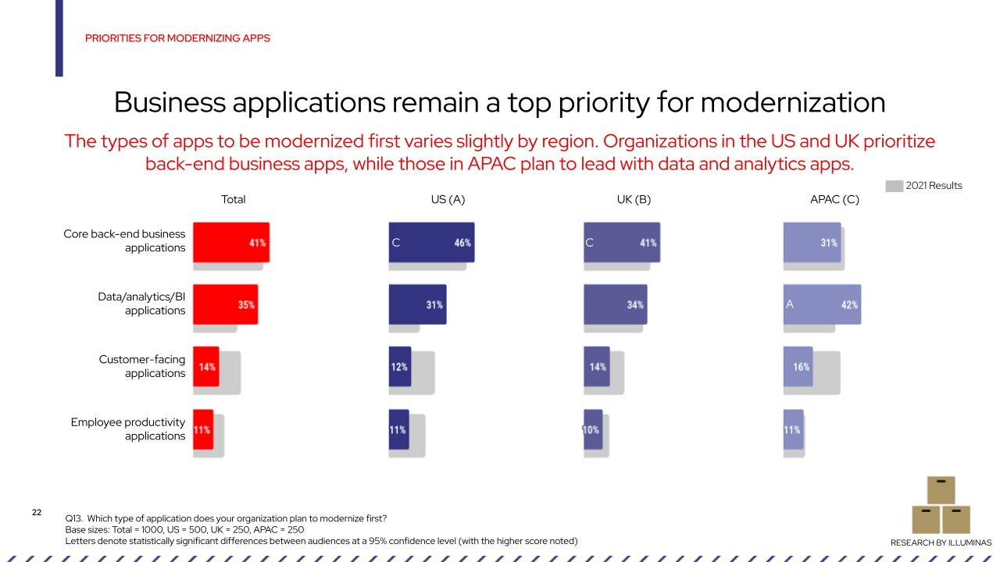
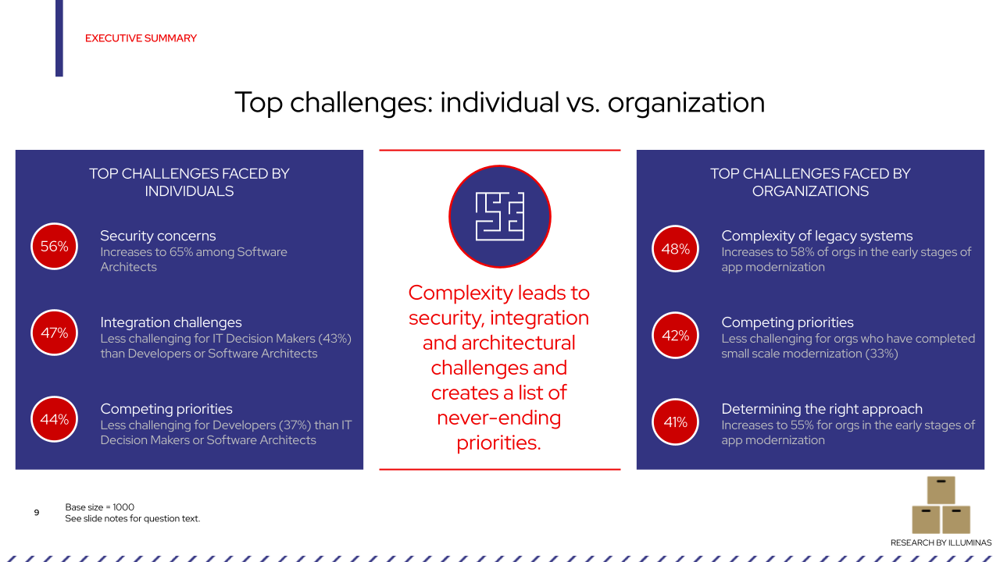
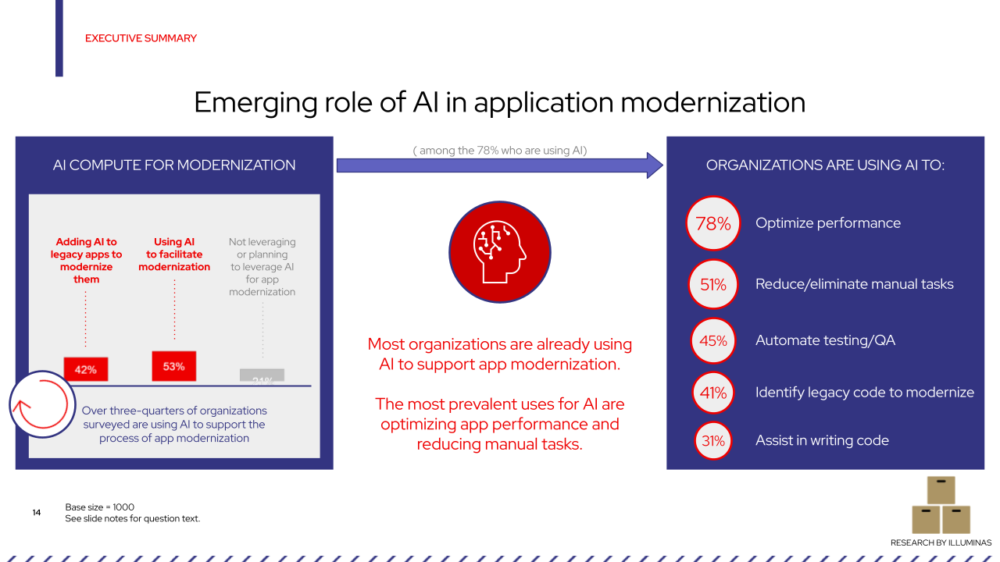
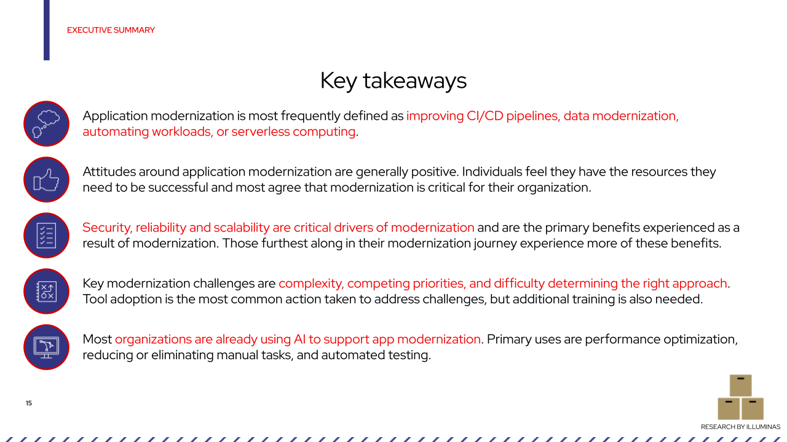

Organizations take a variety of different approaches to modernizing their applications as they target improving security, reliability, and scalability. Relative to our last survey, two years ago, we’re seeing a greater emphasis on updating legacy applications and infrastructure over building new cloud applications.

## About the survey

Konveyor community member Red Hat partnered with research firm Illuminas to better understand how organizations plan to approach application modernization and migration—and what they consider success to look like. In all, 1,000 responses were gathered with half coming from the US and the balance split evenly between the United Kingdom (UK) and English-speaking Asia-Pacific (APAC). Half of the respondents were IT decision makers, a quarter were back-end developers, and a quarter software architects. Most respondents were large enterprises with more than 5,000 employees with the rest working for medium enterprises. A variety of industries including retail, software development, finance, and telecoms were represented.

This survey was conducted in October and November of 2023. An earlier version was conducted in 2021. Many findings are similar across the two surveys. However, because we made a fair number of methodology adjustments, where there are differences we’re just going to highlight a few _major_ changes.

With that background, let’s dive into some of the details about what we found.

## Why are organizations modernizing?

The primary drivers of application modernization—security, reliability, and scalability—are familiar. These drivers, or variants of them, pop up in many of our surveys when we ask questions about things like the expected benefits of digital transformation. Survey respondents almost universally said all three of these drivers were factors in their organization’s decision to modernize their applications. Over 70% also evaluate success based on the results in the same 3 areas.

How are they doing? Pretty well.

If we look at the drivers individually, the most respondents (58%) have already seen security benefits but the majority have also seen reliability (52%) and scalability (53%) benefits. In the context of application modernization projects that are mostly still ongoing, these should be viewed as a very positive sign of the value that application modernization can bring. It’s even more impressive if we look at whether respondents have seen benefits in at least one category. Viewed that way, almost all (98%) have experienced a benefit in at least a single critical area.

## There isn’t one definition of application modernization

This year respondents said that improving CI/CD (continuous integration/delivery) pipelines was their top definition of application modernization at 68%. This is significant for a couple of reasons.

First, this percentage is markedly higher than in our 2021 survey when containerizing workloads was at the top of the list while improving CI/CD was near the bottom. We rarely see this degree of change from survey to survey. This was one of several responses that suggest on traditional IT fundamentals and at least incrementally reduced emphasis on certain newer technologies.

Second, it serves as a useful reminder that not everyone is on the cutting edge. All organizations continue to tweak their CI/CD pipelines to incorporate additional capabilities such as security scanning. However, those who have adopted modern best practices for software development can be reasonably assumed to have solid CI/CD processes in place overall. These numbers suggest that assumption doesn’t apply to everyone. We’ve seen similar trends in other practices over time that have become table stakes for advanced practitioners while others are just dipping their toe in the water.

Another common definition is data modernization, commonly described as  updating and improving an organization's data infrastructure, tools, and practices to meet the evolving needs of data-driven business operations and analytics. It’s reasonable to assume that prepping for artificial intelligence/machine learning is an important rationale for thinking about application modernization in these terms. Data modernization also comes into play as part of modernizing the data exchange between applications and their components as they are updated, such as for distributed data in edge applications. (Other surveys we’ve conducted have found that integration issues are a consistent challenge for digital transformation projects.)

Rounding out the most common definitions were automating workloads and serverless computing. 

## How are organizations modernizing?

Modernization strategies are diverse and most commonly happen in multiple steps.

We asked respondents to answer the question: “What does your organization plan to do with the custom production applications it wants to modernize over the next two years?” The 6 choices we provided followed the 6 Rs framework, a model deriving from the 5 Rs created by market researcher Gartner in 2010 at a time when many businesses were starting to grapple with how best to move their legacy applications to a cloud. (Sometimes you’ll also see a 7 Rs variant.) You’ll find some differences in nomenclature from different sources but the overall framework is widely used.

The 6 strategies are:

**Retire:** Sunset or decommission applications that are no longer needed

**Retain:** Leave critical applications as-is until refactoring is required

**Rehost:** “Lift-and-shift” applications to a cloud (hosted or on-premise) without architectural changes

**Replatform:** Optimize while migrating to the new platform to cloud-enable applications without changing core application code or architecture. (Sometimes referred to as “tweak, lift, and shift.”)

**Refactor:** Re-architect as cloud-native, for example, by containerizing workloads or moving them to a serverless architecture

**Repurchase:** Move from perpetual licenses to a Software-as-a-Service (SaaS) model

The first conclusion we can draw from this survey—as well as others that we’ve done—is that there is no single dominant approach. Replatforming was the most common response at 20% and all the other responses were between 10% and 19%. Modernization strategies for custom applications are diverse and dependent on the applications being modernized, the sophistication of the organization, and even where the respondent sits in the organization. 

The other conclusion that we can confidently draw is that application modernization is not a one and done project. Rather, there’s a clear incremental path to re-architected applications. Just 15% of respondents plan to go straight to refactoring. But that doesn’t mean refactoring is off the table for the future. Indeed, 47% plan to replatform and then refactor. Another 38% plan to rehost, then replatform, and only then refactor. (Among organizations who describe their application modernization as a continuous process, this last category shoots all the way up to 52%.)

 __

## What does application modernization focus on?

We can roughly lump application modernization into two buckets: 

1. Modernizing existing (legacy) infrastructure/applications 

2. Delivering or building new infrastructure, cloud services, and modern or native cloud-native applications or other modern IT services. 

We found that 59% of modernization budgets were in service of the 1st category with the remaining 41% falling into the 2nd. Results across regions were essentially identical.

Relative to our survey two years ago, the budget allocation for modernization has shifted _much_ more toward updating legacy applications and infrastructure relative to building new applications and infrastructure in the cloud. The numbers roughly flipped between the two surveys and would seem where there is a renewed focus on IT fundamentals.

Digging deeper into the types of applications being prioritized for modernization reinforces this view.

Core back-end applications are the top priority at 41% followed by data/analytics/business intelligence applications at 35%. (This again highlights the importance of data for AI and related technologies.) Here, the result did vary by region with APAC approximately flipping the back-end applications and data-related application numbers. Across all geographies, customer-facing applications were a relatively low priority at 14% overall.

These numbers provide an interesting counterpoint to the bimodal (or fast/slow) IT idea that was making the rounds about a decade ago. It came from a school of thought that legacy back-end applications would tend to be set off to the side and minimally changed—Retained in 6 Rs terminology—while all the exciting action would be on new customer-facing applications and services. 

The results from this survey show that, in fact, companies are prioritizing the applications that run their businesses and the data that informs their business decisions. However, new applications and services —including customer-facing applications— are certainly being delivered as well.

_\[A focus on legacy apps and infrastructure \[_[_slide 21 complete_](https://docs.google.com/presentation/d/1BJJSCFDb-1Y0aSZ1tXj6MZ_oC-Wy4uawKfa9lf4EEc4/edit#slide=id.g2a0dee27665_1_813)_] with a continued focus on core back-end business applications and an increased focus on data/bi \[_[_slide 22 complete_](https://docs.google.com/presentation/d/1BJJSCFDb-1Y0aSZ1tXj6MZ_oC-Wy4uawKfa9lf4EEc4/edit#slide=id.g2a0dee27665_1_853)_]]_

## What are organizations doing to address modernization challenges? 

Complexity dominates the top organizational challenges with 48% of respondents identifying this particular challenge. In the early stages of application modernization, it’s even higher—58%. In early stages, determining the right approach was also high on the list at 55% although, even beyond early stages, it still ranked high at 41%.

However, companies are taking steps to address the challenges faced at both the organizational and individual levels. One US-based IT decision maker recommended that you “set clear objectives and goals for the modernization process, establish a dedicated modernization team, and conduct a comprehensive assessment of your current application portfolio.” The quantitative results from our survey similarly emphasized up-front planning and a systematic approach with researching/adopting additional tools, API-driven development, building a business case, and implementingDevOps practices at the top of the list when it came to actions their organizations are taking in response to modernization challenges.

## AI has an important emerging role in application modernization 

The surprise would probably be if AI _didn’t_ somehow factor into application modernization, given its important emerging role in so many areas of IT and elsewhere. Over 75% of organizations surveyed are using AI to support the application modernization process. Using AI to facilitate modernization is most common (53%) but a significant number (42%) is also, or alternatively, adding AI to existing legacy applications to modernize them.

Performance optimization is the most common use case by a significant margin—complex distributed systems increasingly exceed the ability of people to effectively tune them by hand, hence AIOps. However, automation both of manual tasks broadly and testing/QA specifically are also important roles for AI. Directly assisting in writing code, on the other hand, seems to still be relatively nascent and was less cited than other uses notwithstanding the buzz (and sometimes controversy) around large language models (LLM) in many developer circles.

Overall, most organizations are already using AI to support application modernization and the activity is quite consistent across geographies.

## What does this mean for you?

Our respondents had some sound advice to offer, both about getting started and keeping projects on track along the way.

With respect to kicking off an application modernization project, an IT decision maker from APAC emphasized how “setting realistic and clear goals before you start your modernization journey gives you greater control over the upgrade process.” Themes among the decision makers, architects, and developers we spoke with included: up-front planning, incremental approaches, and having the right team that’s well-equipped.

The decision makers we spoke with also had advice for once modernization projects were kicked off. One of them from the UK recommended that “firms should invest in monitoring and visualization solutions for more successful application and system modernization. These systems provide more information about the current state and performance of applications.” Another decision maker from the US emphasized training “your workforce to use and maintain new applications through best practices and governance.”

Overall, there are some clear common themes: have a concrete goal, plan, enable the right team, and continuously monitor (including vulnerability scanning). Interestingly, hiring subject matter experts and providing additional training weren’t the priorities that we’ve seen across other surveys. One reason is that there seems to be at least incrementally more focus on outsourcing—such as managed services—and consulting with communities and vendors on best practices among the respondents here. Skilling up still matters. But so does leaning on third-party expertise and capabilities when available and appropriate.

## Slide deck with all findings

[State of application modernization 2024](https://www.slideshare.net/slideshows/state-of-application-modernization-2024-report-c3ee/266806393) from [Konveyor Community](https://www.slideshare.net/KonveyorIO)

_Gordon Haff is Technology Advocate at Red Hat where he works on emerging technology strategy; writes about tech, trends, and their business impact; and is a frequent speaker at customer and industry events. Among the topics he works on are edge, blockchain, AI, quantum, cloud-native platforms, and next-generation application architectures. His books include From Pots and Vats to Programs and Apps and How Open Source Ate Software. His current podcast is Innovate @ Open. Prior to Red Hat, as an industry analyst, Gordon wrote hundreds of research notes, was frequently quoted in major publications on a wide range of IT topics, and advised clients on product and marketing strategies._

