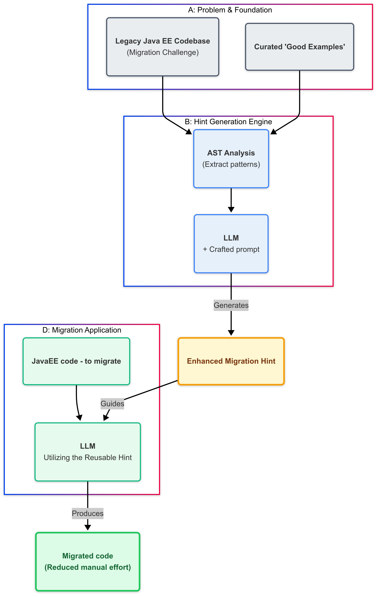

**Author**: [Savitha Raghunathan](https://www.linkedin.com/in/savitharaghunathan) ([GitHub](https://github.com/savitharaghunathan))

For the past several weeks, I’ve been running through a series of migration scenarios—everything from JMS-based Message-Driven Beans to Quarkus Reactive Messaging, JDK 8 apps to Java 17, and Spring Boot 2 services to Spring Boot 3 with Jakarta EE. Each scenario is its own mini experiment. I curated a handful of flawless before/after code pairs, extracted their AST diffs, crafted a focused LLM prompt, then used that to get hints.

The above loop—_“design hypothesis, feed the model examples, validate against real code, tweak prompts, repeat”_—is the core of building Kai’s Generative AI hint component. It’s not “build feature X” so much as “run experiments until the model reliably reproduces our hard-won migrations.” In the sections below, you’ll shadow me through one of these R&D cycles: spinning up a JMS→Quarkus scenario, framing the perfect prompt, and ultimately capturing the distilled insight into a reusable hint.


_Note: "Header image generated with AI"_

As a part of Kai’s future roadmap, there is a huge emphasis on the **Solution Server**—a component designed to use the solved examples from previous successful migrations and apply that knowledge in similar new scenarios. In Konveyor’s migration workflows, migrators/architects write rules that identify a problem (for example, “this class uses JMS”), but these rules often lack the extra contextual information developers need to fix it efficiently. A migration rule must do two things:

1. **Identify a problem**  
2. **Provide enough context** so developers know exactly how to fix it

This research addresses that second part by showing how to extract and generalize migration insights from a small set of solved examples. Migrating a Java EE codebase can derail timelines if every class needs manual annotation fixes, import corrections, or tweaks. We discovered that by researching how a small set of “good example” migrations worked, then asking an LLM model to distill that insight into a single, reusable hint, we were able to migrate Java classes with far less manual intervention.

Below, I’ll walk you through the research journey, give you a taste of the prompt outline, and show concise before/after snippets. Finally, we’ll see how this generated hint produces reliable results.


## 1. From “Good Examples” to a Reusable Hint

> **The starting point was:**  
> “We have a handful of Java EE JMS MDBs already migrated to Quarkus and they look perfect. How do we capture that pattern and apply it across various migrations?”

We had several “before” Java EE classes (using `@MessageDriven`, `implements MessageListener`, legacy JMS imports) and their “after” Quarkus migrations (annotated with `@Incoming("…")`, `@ApplicationScoped`, `@Transactional`, and valid MicroProfile/Jakarta imports). By studying these good examples, we aimed to use an LLM to generalize a hint that can be used in similar future migrations.



### 1.1. High-Level Steps in Process

With the goal of enriching rules with contextual guidance firmly in mind, here are the five stages of hint generation—a key step in our larger Solution Server architecture:

1. **Curate “Good Example” Pairs**  
   - Select a small set of Java EE → Quarkus migrations that compile perfectly (e.g., JMS MDBs already converted).  
   - Confirm each one uses correct Quarkus/MicroProfile imports, annotations, and naming conventions.

2. **Extract Structural Summaries & Diffs**  
   - Use Kai’s `extract_ast_info()` to capture the “before” and “after” at a high level: which annotations disappeared, which interfaces dropped, which imports changed, and which annotations appeared.  
   - Compute a diff that distills those changes into operations like “remove `@MessageDriven`,” “remove `implements MessageListener`,” “add `@ApplicationScoped`,” and so on.

3. **Craft a Good Prompt**  
   - **Goal:** Feed the LLM just enough context so it understands the pattern without overwhelming it with raw code.  
   - **Prompt Blurb (example):**

   ```text!
   You are an expert in migrating JMS MessageDriven beans (Java EE) to Quarkus SmallRye Reactive Messaging.

   Here is a reference migration summary:
   <AST diff examples>
   <Original minimal hint>

   **Task:**
   Take the above inputs and migrate the code to generate a hint that can assist in future migrations.

   <formatting of the enhanced generated hint>
    ```
The prompt was iterated until it produced a hint that matched the expectations.


4. **Validate the Model’s Hint**


The original hint for migrating JMS elements to Quarkus was very minimal.
Original minimal hint:

```text!
description: References to JavaEE/JakartaEE JMS elements should be removed and replaced with their Quarkus SmallRye/MicroProfile equivalents.
message: |
  References to JavaEE/JakartaEE JMS elements should be removed and replaced with their Quarkus SmallRye/MicroProfile equivalents.

```

Using the examples and the prompt discussed earlier, the model ( in this case GPT-4o-mini) returned an enhanced hint. 

Enhanced Hint:

```text!
description: Migrating Java EE MDBs and JMS to Quarkus-native messaging solutions
message: |
 This migration focuses on replacing Java EE Message-Driven Beans (MDBs) and Java Message Service (JMS) usage with Quarkus-native equivalents, specifically using the Quarkus Messaging extension. The goal is to leverage Quarkus's reactive programming model and simplified configuration for improved performance and maintainability.

 Actionable Steps:

 * Step 1: Add the Quarkus Messaging extension to your project by including the following dependency in your `pom.xml` or `build.gradle`:
 
   <dependency>
       <groupId>io.quarkus</groupId>
       <artifactId>quarkus-resteasy</artifactId>
   </dependency>
   

 * Step 2: Replace your MDBs with a Quarkus `@Incoming` method. Define a method in a CDI bean that listens to the desired queue or topic:
   
   @Incoming("your-queue-name")
   public void processMessage(String message) {
       // Handle the incoming message
   }
   

 * Step 3: Configure your JMS connection settings in `application.properties`:
   
   quarkus.jms.connection-factory.my-connection-factory = your-connection-factory
   quarkus.jms.destination.your-queue-name = your-queue
   

 * Step 4: Remove any references to the old MDBs and JMS APIs from your codebase.

Optional Changes:

* Suggestion 1: Consider using Quarkus's reactive messaging capabilities for better scalability and performance.
* Suggestion 2: Review your error handling strategy, as Quarkus provides different mechanisms for handling message processing failures.
```

This enhanced hint was validated with other models and examples and consistently produced the expected, fully migrated code.

5. **Generalize**


With this hint in hand, the same recipe could be reused for other JMS-based issues. This concept can be extended to any migration issue backed by a good set of before and after migration examples.

## 2. Applying the Hint 
Once the hint was finalized, the next step was to test it with other models and examples.
The below example is uses the above generated hint and the model - llama-3.1-8B-Instruct

2.1. **Before / After Example (JMS → Quarkus)**

Before:

```java! 
import javax.jms.* 

public class InventoryNotificationMDB implements MessageListener {

    private static final int LOW_THRESHOLD = 50;

    @Inject
    private CatalogService catalogService;

    private final static String JNDI_FACTORY = "weblogic.jndi.WLInitialContextFactory";
    private final static String JMS_FACTORY = "TCF";
    private final static String TOPIC = "topic/orders";
    private TopicConnection tcon;
    private TopicSession tsession;
    private TopicSubscriber tsubscriber;

    public void onMessage(Message rcvMessage) {
        TextMessage msg;
        {
            try {
                System.out.println("received message inventory");
                if (rcvMessage instanceof TextMessage) {
                    msg = (TextMessage) rcvMessage;
                    String orderStr = msg.getBody(String.class);
                    Order order = Transformers.jsonToOrder(orderStr);
                    order.getItemList().forEach(orderItem -> {
                        int old_quantity = catalogService.getCatalogItemById(orderItem.getProductId()).getInventory().getQuantity();
                        int new_quantity = old_quantity - orderItem.getQuantity();
                        if (new_quantity < LOW_THRESHOLD) {
                            System.out.println("Inventory for item " + orderItem.getProductId() + " is below threshold (" + LOW_THRESHOLD + "), contact supplier!");
                        } else {
                            orderItem.setQuantity(new_quantity);
                        }
                    });
                }


            } catch (JMSException jmse) {
                System.err.println("An exception occurred: " + jmse.getMessage());
            }
        }
    }
    }
```

After migration using the hint:

```java!
import jakarta.enterprise.context.ApplicationScoped;
import jakarta.inject.Inject;
import jakarta.transaction.Transactional;
import org.eclipse.microprofile.reactive.messaging.Incoming;

import java.math.BigDecimal;

@ApplicationScoped
public class InventoryNotification {

    private static final int LOW_THRESHOLD = 50;

    @Inject
    private CatalogService catalogService;

    @Incoming("orders-topic")
    @Transactional
    public void processOrder(String orderStr) {
        Order order = Transformers.jsonToOrder(orderStr);
        order.getItemList().forEach(orderItem -> {
            int oldQuantity = catalogService.getCatalogItemById(orderItem.getProductId()).getInventory().getQuantity();
            int newQuantity = oldQuantity - orderItem.getQuantity();
            if (newQuantity < LOW_THRESHOLD) {
                System.out.println("Inventory for item " + orderItem.getProductId() + " is below threshold (" + LOW_THRESHOLD + "), contact supplier!");
            } else {
                orderItem.setQuantity(newQuantity);
            }
        });
    }
}

```

Without the hint, migration might forget the `@Transactional` or miss dropping a `javax.jms.*` import, leading to compilation issues. With the enhanced hint, the model produced a code that matched the expectations. 

## Conclusion
By starting with a curated set of solved migrations and extracting their structural differences, we used an LLM to generate a concise, reusable hint that addresses every necessary annotation change, import swap, and configuration tweak.Using the newly generated hint  allowed us to migrate new Java EE MDBs (and similar classes) with minimal manual intervention.

If you’re interested in application modernization, AI-driven developer tools, or want to contribute to something exciting and community-led, [come join us!](https://github.com/konveyor/community/blob/main/README.md)

Looking forward to your [feedback, ideas, and collaboration](https://github.com/konveyor/kai/issues/new) as we grow Kai together!

