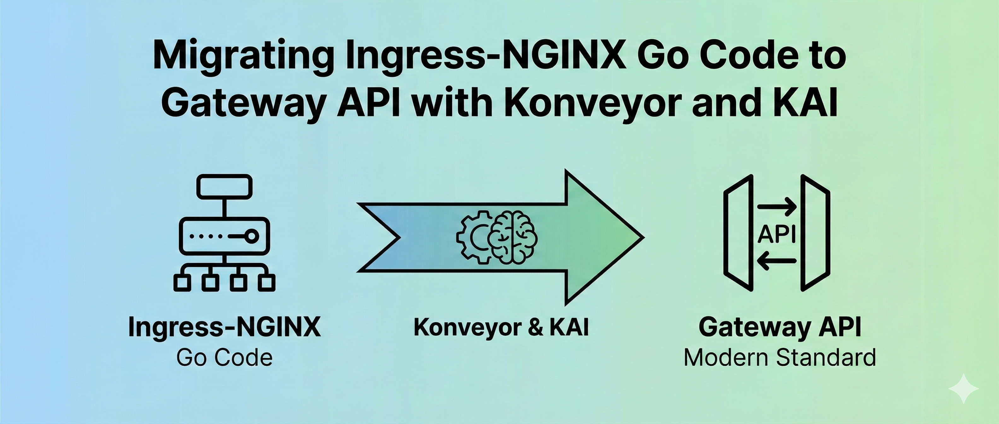

**Author:** [Savitha Raghunathan](https://github.com/savitharaghunathan)

[Ingress NGINX](https://github.com/kubernetes/ingress-nginx) has been a cornerstone of Kubernetes networking for years, powering traffic routing for countless production workloads. As the ecosystem evolves, the project has [announced its retirement](https://kubernetes.io/blog/2025/11/11/ingress-nginx-retirement/), passing the torch to the [Gateway API](https://gateway-api.sigs.k8s.io/) — a more expressive, role-oriented successor. Tools like [`ingress2gateway`](https://github.com/kubernetes-sigs/ingress2gateway) make it straightforward to convert Ingress YAML manifests into [Gateway](https://gateway-api.sigs.k8s.io/api-types/gateway/) and [HTTPRoute](https://gateway-api.sigs.k8s.io/api-types/httproute/) resources.

But what about the Go programs that *build* Ingress objects in code?

Many platform teams have operators and CLI tools written in Go that programmatically create and manage Ingress resources using [`k8s.io/api/networking/v1`](https://pkg.go.dev/k8s.io/api/networking/v1) and [`client-go`](https://github.com/kubernetes/client-go). `ingress2gateway` can convert the deployed Ingress resources, but it doesn't modify the Go source code that creates and manages them. You'd still need to update every `networkingv1` type reference, every `client-go` API call, and every nginx annotation string in your codebase. [Konveyor](https://konveyor.io) addresses this source code side of the migration.


*Image generated with Gemini Nano Banana Pro.*

## How Konveyor Fills the Gap

Konveyor with [KAI](https://github.com/konveyor/kai) addresses code-level migration through three capabilities:

- **Discovery** — the [Konveyor Go extension](https://marketplace.visualstudio.com/items?itemName=konveyor.konveyor-go) scans Go source to find every reference to Ingress types, `client-go` API calls, and nginx annotation strings
- **Migration guidance** — each rule produces a [violation](https://github.com/konveyor/analyzer-lsp/blob/main/docs/rules.md) with concrete steps showing the Gateway API equivalent
- **KAI fixes** — KAI uses the rule messages as LLM context to generate context-aware Gateway API code, understanding the surrounding Go source

The Konveyor Go extension uses the vscode go extension to detect type references — so it knows the difference between [`networkingv1.Ingress`](https://pkg.go.dev/k8s.io/api/networking/v1#Ingress) (the Kubernetes type) and a random variable named `ingress`. This gives you precise, low-noise results.

## The Migration Scenario

I built a [sample migration scenario](https://github.com/savitharaghunathan/ingress-to-gateway-migration-konveyor) to demonstrate this workflow. The [sample app](https://github.com/savitharaghunathan/ingress-to-gateway-migration-konveyor/tree/main/go-app-v2) is a Go CLI tool that a platform team uses to provision standardized Ingress resources for tenant applications. It uses the full spread of Ingress-NGINX patterns:

| Ingress Concept | Gateway API Equivalent |
|---|---|
| [`Ingress`](https://pkg.go.dev/k8s.io/api/networking/v1#Ingress) | [`HTTPRoute`](https://gateway-api.sigs.k8s.io/api-types/httproute/) + [`Gateway`](https://gateway-api.sigs.k8s.io/api-types/gateway/) |
| [`IngressClass`](https://pkg.go.dev/k8s.io/api/networking/v1#IngressClass) | [`GatewayClass`](https://gateway-api.sigs.k8s.io/api-types/gatewayclass/) |
| `kubernetes.io/ingress.class` annotation | [`HTTPRoute.spec.parentRefs`](https://gateway-api.sigs.k8s.io/api-types/httproute/#gateway-networking-k8s-io-v1-httproute) |
| TLS via `spec.tls` | TLS on [`Gateway.spec.listeners`](https://gateway-api.sigs.k8s.io/api-types/gateway/#gateway-networking-k8s-io-v1-gateway) |
| nginx annotations (ssl-redirect, HSTS, timeouts) | Native [HTTPRoute filters](https://gateway-api.sigs.k8s.io/reference/spec/#gateway.networking.k8s.io/v1.HTTPRouteFilter) |

I wrote [custom rules](https://github.com/savitharaghunathan/ingress-to-gateway-migration-konveyor/tree/main/rules) to detect these patterns — 8 rules use the [`go.referenced`](https://github.com/konveyor/analyzer-lsp/blob/main/docs/rules.md) provider for type-level detection, and the rest use [`builtin.filecontent`](https://github.com/konveyor/analyzer-lsp/blob/main/docs/rules.md) for string patterns like client-go API calls and annotation keys. When Konveyor analyzes the sample app, it finds **16 issues with 38 total incidents**.

## From Violations to Fixes

The violations fall into three categories:

**Type references** — flags every usage of `networkingv1` types and shows the [Gateway API](https://gateway-api.sigs.k8s.io/) equivalent ([HTTPRoute](https://gateway-api.sigs.k8s.io/api-types/httproute/), [GatewayClass](https://gateway-api.sigs.k8s.io/api-types/gatewayclass/), [HTTPRouteRule](https://gateway-api.sigs.k8s.io/reference/spec/#gateway.networking.k8s.io/v1.HTTPRouteRule)):

```text
networkingv1.Ingress      →  gatewayv1.HTTPRoute
networkingv1.IngressClass →  gatewayv1.GatewayClass
networkingv1.IngressRule  →  gatewayv1.HTTPRouteRule
networkingv1.IngressTLS   →  Gateway.spec.listeners[].tls
```

**Client-go API calls** — flags the Kubernetes API calls that need to change. The Gateway API uses a [separate clientset](https://pkg.go.dev/sigs.k8s.io/gateway-api/pkg/client/clientset/versioned) (not the core `client-go`); use `GatewayV1().HTTPRoutes(namespace)` and `GatewayV1().GatewayClasses()` on that client:

```text
.NetworkingV1().Ingresses(namespace)  →  .GatewayV1().HTTPRoutes(namespace)
.NetworkingV1().IngressClasses()      →  .GatewayV1().GatewayClasses()
```

**Annotation patterns** — flags nginx annotation strings and maps them to native [Gateway API filters](https://gateway-api.sigs.k8s.io/reference/spec/#gateway.networking.k8s.io/v1.HTTPRouteFilter) and [timeouts](https://gateway-api.sigs.k8s.io/reference/spec/#gateway.networking.k8s.io/v1.HTTPRouteTimeouts):

```text
ssl-redirect            →  TLS on Gateway listener + RequestRedirect filter
configuration-snippet   →  ResponseHeaderModifier filter
proxy-read/send-timeout →  HTTPRouteTimeouts (native on HTTPRouteRule)
HSTS annotations        →  ResponseHeaderModifier with Strict-Transport-Security header
```

With KAI's [GenAI configured](https://github.com/konveyor/kai/blob/main/docs/configuration.md), click the wrench icon on a violation to request a fix. KAI uses the incident details to generate a targeted fix. The changes can be reviewed before applying.

## Writing Custom Rules

The [rules](https://github.com/savitharaghunathan/ingress-to-gateway-migration-konveyor/tree/main/rules) use two providers (go and builtin), and the `message` field is what KAI feeds to the LLM as migration context:

**`go.referenced`** — detects type-level references via [gopls](https://github.com/golang/tools/tree/master/gopls):

```yaml
- ruleID: ingress-nginx-go-ref-00001
  category: mandatory
  effort: 3
  when:
    go.referenced:
      pattern: '\bIngress\b'
  message: |
    This code references `networkingv1.Ingress`. Migrate to
    `gatewayv1.HTTPRoute`.
```

**`builtin.filecontent`** — matches string patterns in Go files:

```yaml
- ruleID: ingress-nginx-go-ref-00028
  category: mandatory
  effort: 1
  when:
    builtin.filecontent:
      pattern: 'nginx\.ingress\.kubernetes\.io/proxy-(read|send|connect)-timeout'
      filePattern: "*.go"
  message: |
    Replace proxy timeout annotations with HTTPRouteTimeouts.
```

A well-crafted message with concrete before/after code examples leads to better-generated fixes. You can follow the same approach to write custom rules for other migration scenarios.

## Demo

[](https://youtu.be/qNdqfI7wgfM)

## Try It Out

This scenario demonstrates Konveyor's capabilities with Go, but Konveyor supports multiple languages. The [Konveyor extension pack](https://marketplace.visualstudio.com/items?itemName=konveyor.konveyor) bundles providers for Java, JavaScript, Go, and C# — install once and the right provider activates when it detects a matching project. Whether you're migrating [Java EE to Quarkus](https://quarkus.io), upgrading [Spring Boot](https://spring.io/projects/spring-boot), or modernizing Go infrastructure tooling like this scenario, Konveyor and KAI can help discover what needs to change and generate the fixes.

Check out the [step-by-step tutorial](https://github.com/savitharaghunathan/ingress-to-gateway-migration-konveyor/blob/main/TUTORIAL.md), and join us on the [Konveyor community](https://github.com/konveyor). We look forward to your [feedback, ideas, and collaboration](https://github.com/konveyor/kai/issues/new) as we grow Konveyor and KAI together.
